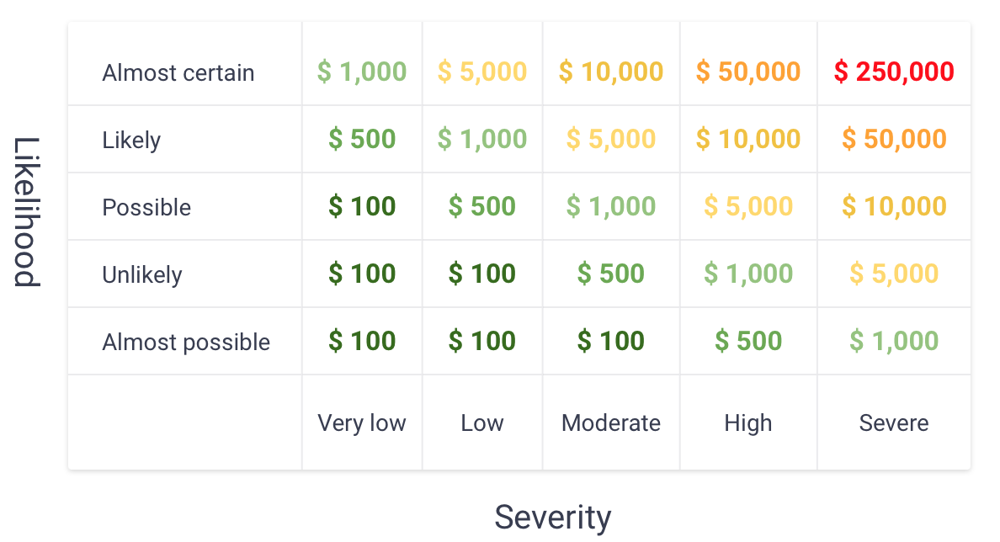

# Bug Bounty

## Overview

Ensuring the security of smart contracts is of utmost importance. To that end, as of [06 February 2023], the codebase of GHO - a decentralized, overcollateralized crypto-asset intended to maintain stable value - is subject to the GHO Bug Bounty Program (the “Program”). The Program provides an opportunity for community members to report “bugs” or vulnerabilities for a chance to earn rewards. The aim of the Program is to motivate the security community to take an active role in enhancing the security of open-source software.

Rewards will be allocated based on the severity of the bug disclosed and evaluated and rewarded **up to USD $250,000**.

The scope, terms and rewards are at the sole discretion of the team (the “Team”).

## Scope

The Program includes the vulnerabilities and bugs in the GHO repository (located in the GitHub repositories, primarily at: [aave/gho](https://github.com/aave/gho)).

The following are not within the scope of the Program:

- Bugs in any third party contract or platform that interacts with GHO;
- Vulnerabilities related to domains, DNS or servers of websites;
- Any already-reported bugs or other vulnerabilities.

Determinations of eligibility, score and all terms related to rewards and their payment are at the sole discretion of the Team.

# Eligibility

To be eligible for a reward under this Program, you must:

- Discover a previously unreported, non-public vulnerability within the scope of this Program. Vulnerabilities must be distinct from the issues covered in the previously conducted publicly available audits.
- Be the first to disclose the unique vulnerability to the Team by the disclosure requirements below. If similar vulnerabilities are reported, the first submission shall receive the reward (subject to validation and Program eligibility).
- Possess sufficient technical knowledge and provide sufficient information necessary to reproduce and fix the vulnerability.
- Not engage in any unlawful conduct when disclosing the bug, including through threats, demands, or any other coercive tactics.
- Refrain from exploiting the vulnerability, including making it public or profiting from it (other than through the reward offered by the Program). Any form of publicity, direct or indirect, related to the vulnerability will result in disqualification from the Program.
- Limit submissions to one vulnerability per report, unless multiple vulnerabilities are required to demonstrate the impact. For additional information, create a new submission referencing the initial one.
- Not submit separate vulnerabilities that stem from the same underlying issue for which a reward has already been paid under the Program.
- Submit only one vulnerability per submission unless you need to chain vulnerabilities to impact any vulnerabilities. If you want to add more information to a provided issue, create a new submission referencing the initial one.
- Be an individual who is not our current or former employees, vendors, service providers, or contractors or an employee of any of those vendors or contractors or an immediate family (parent, sibling, spouse, or child) or household member of such person.
- Not be one of our current or former employees, vendors, service providers, or contractors or an employee of any of those vendors or contractors or an immediate family (parent, sibling, spouse, or child) or household member of such person.
- Not be subject to any international, national or state level sanctions.
- Be at least 18 years of age or, if younger, submit your vulnerability with the consent of your parent or guardian.

## Disclosure

Any identified vulnerability or bug must be promptly reported to the Team via gho-security@aave.com. The report should be submitted within 24 hours of discovery, and the vulnerability must not have been exploited or disclosed to any third party, except the Team, before the report is submitted and the issue is fixed. This includes avoiding any form of publicity or dissemination of the vulnerability.

## Rewards

All submissions are evaluated by the Team on a case-by-case basis. Rewards are allocated based on the severity of the issue, and other variables, including but not limited to: a) the quality of the issue description; b) the instructions for reproducibility; and c) the quality of the fix (if included). A detailed report of a vulnerability increases the likelihood of a reward and may increase the reward amount. Therefore, please provide as much information about the vulnerability as possible.

The Program intends to follow a similar approach as the Ethereum Bug Bounty, where the severity of the issues will be based according to the OWASP risk rating model based on “Impact” and “Likelihood”. The evaluation of scoring is however at the sole discretion of the Team

All rewards are paid in USDC via a transfer to the wallet address provided by the participant to the Team. The reward can’t be exchanged into other crypto assets or fiat. As a condition of participating in this Program, the participants give the Company permission to share their wallet address and other information provided by them to third parties for the purpose of administering this Program and complying with applicable laws, regulations, and rules.

The reward will be received in USDC token based on the following severity scheme:

**Note** = Up to 100 USDC

**Very low** = Up to 500 USDC

**Low** = Up to 1,000 USDC

**Medium** = Up to 5,000 USDC

**High** = Up to 10,000 USDC

**Very High** = Up to 50,000 USDC

**Critical** = Up to 250,000 USDC

## Other terms

The decisions made regarding rewards are final and binding.

By submitting your report, you grant the Company any and all rights, including without limitation intellectual property rights, needed to validate, mitigate, and disclose the vulnerability. All reward decisions, including eligibility for and amounts of the rewards and how such rewards will be paid, are made at the sole discretion of the Company.

The Company is not and will not be liable for any damages resulting from the use or inability to use the software.

Terms and conditions of the Program may be altered at any time. The Company may change or cancel this Program at any time, for any reason.
